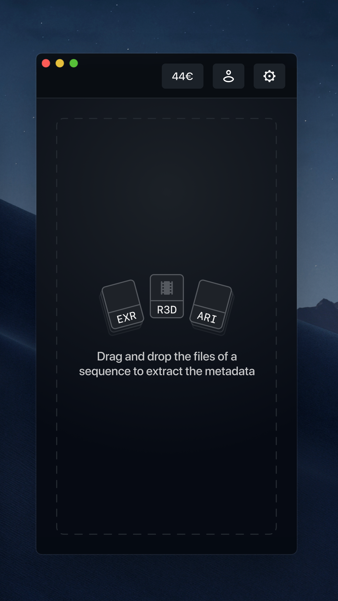
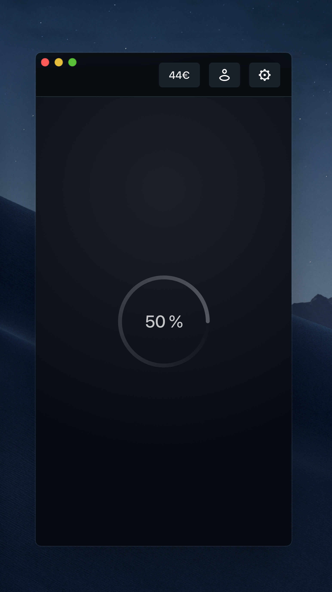
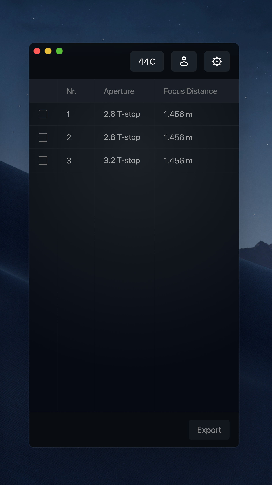
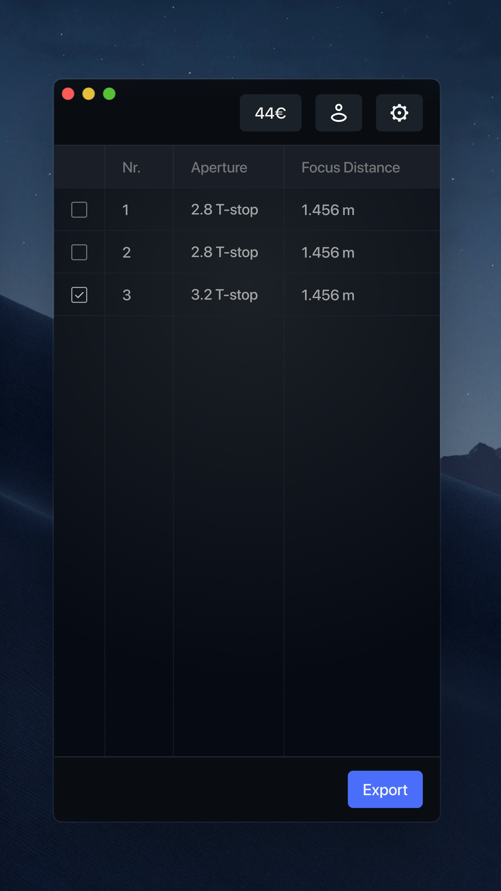
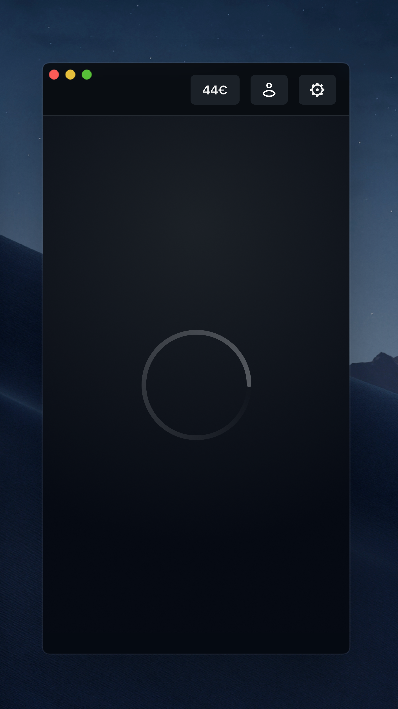

# Coding Assignment

Develop a Web Browser based GUI application that enables the user

- to extract frame-related metadata from a set of `txt` files, and
- to export the metadata of selected frames into a single `csv` file.

## Screens

Please take a look at the images in the `Screens` directory to understand the design of the GUI. Each screen will be briefly explained in the following subsections.

### Important Note

It is **not required** to deliver a result which exactly matches the screens you are going to see in the following sections. So, certain deviations from the specification are absolutely fine.

The font used for creating the screens is `SF Pro Display` which is not available on all operating systems. It is therefore ok to choose a diffent font-familiy and to have slightly different font-sizes.

It is ok to have slightly different widths/heights for the columns/rows shown on screens 3 and 4.

It is ok to use the default style available on the operating system for the checkboxes shown on screens 3 and 4.

### Screen 1

This is the first screen the user must see when the application is launched. The user must be able to drag and drop files into the dropzone. This is how it looks like:

There is no need for highlighting the zone when `dragover` event is fired.

The buttons in the top bar just have to be there and have no other function.

### Screen 2

When a set of `txt` files is selected, the application must automatically transition into this screen to show the user the progress of the metadata extraction. This is how it looks like:

### Screen 3

When the metadata extraction is completed, the application must automatically transition into this screen to show the user the extracted metadata. This is how it looks like:

The values for the column `Nr.` must be extracted from the names of the `txt` files. So, the frame number in case of `A013C007_210415_R1U4.010.exr.txt` would be `10`.

The values for the column `Aperture` must be extracted from the contents of the `txt` files. The aperture is stored in the line which starts with `aperture (type float):`. The value is given in `T-stop`.

The values for the column `Focus Distance` must be extracted from the contents of the `txt` files. The focus distance is stored in the line which starts with `focus (type float):`. The value is given in `meter`.

As long as none of frames are selected, the button with the title "Export" must be disabled.

### Screen 4

The user must be able to select frames by clicking the corresponding input element shown in the first column. This is how it looks like:

As long as at least one frame is selected, the button with the title "Export" must be enabled.

### Screen 5

When the export button is clicked, the application must automatically transition into this screen to show the user that the export is currently in progress. This is how it looks like:

There is no need for showing the progress in percentage. Only having the loading spinner is sufficient.

Since the export will probably take only a few miliseconds, this screen must be visible for at least a second.

The application must automatically transition into the first screen when all the operations are completed.

Tthe csv file can be written into any location, like into a file called `output.csv` in the downloads directory of the user. But you can also choose a different location, if you want to.

## Assets

Please take a look at the files in the `Assets` directory for all the assets needed in the GUI.

## Input & Output

Please take a look at the files in the `Input` and `Output` directories to understand how the format of the input file looks like and how the format of the output file has to be.

## Technology Stack

Please make use of the following languages and technologies:

- HTML, CSS, JavaScript
- React
- If needed, any addon modules from NPM
